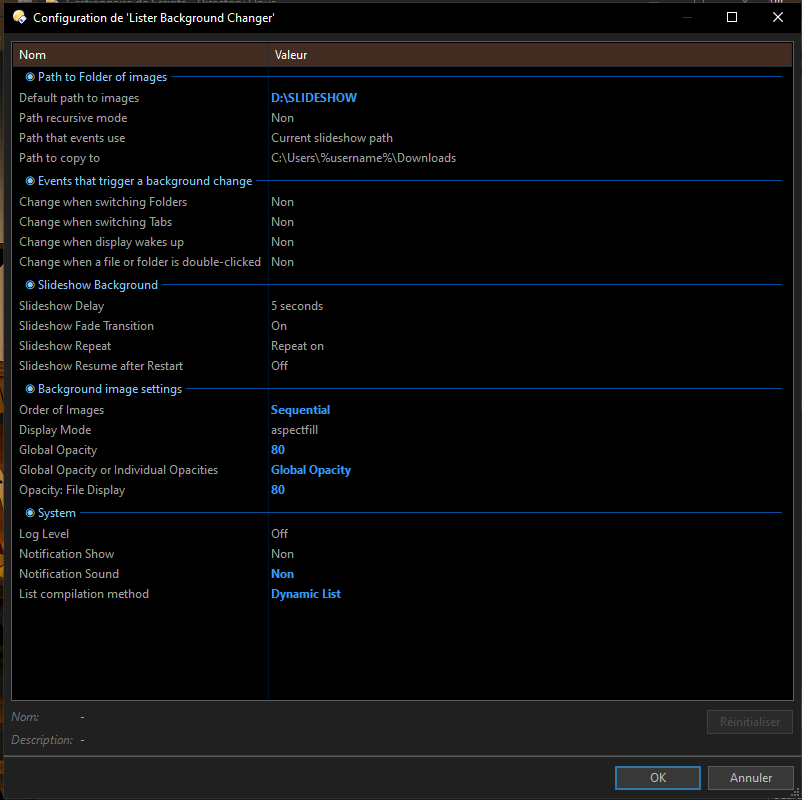

Background Lister Changer

A Directory Opus 13 script that enhances your file manager by dynamically changing lister backgrounds and adding slideshow-style functionality. Designed for users who want a more personalized, visually engaging workspace.

---

✨ Features

- Dynamic Backgrounds  
  Automatically updates lister backgrounds with images from your chosen folder.

- Slideshow Support  
  Cycle through images as backgrounds, creating a smooth slideshow effect inside your listers.

- Viewer Integration  
  Supports showing current backgrounds in the standalone viewer for a larger preview.

- Clipboard & Navigation  
  Copy the current background image or open its folder location in a new tab.

- Customizable Buttons/Hotkeys  
  All functions can be mapped to toolbar buttons or hotkeys for quick access.

---

📖 Usage

Once installed, the script provides new functionality inside Directory Opus. You can:

- Add buttons to toolbars for slideshow control.  
- Assign hotkeys to cycle through backgrounds.  
- Use the standalone viewer to preview current images.  
- Copy or navigate to background files directly.

⚡ Custom Commands ⚡

- Slideshow on/off:  
  ListerBackgroundChanger

- Previous background:  
  ListerBackgroundChanger PREV

- Next background:  
  ListerBackgroundChanger NEXT

- Copy current background:  
  ListerBackgroundChanger CLIP=image

- Show current background in standalone viewer:  
  ListerBackgroundChanger SLIDESHOWINVIEWER

- Open current background folder location in a new tab:  
  ListerBackgroundChanger NEWTAB

🌹🌹 Install Notes 🌹🌹
-You must have Directory Opus 13.16
-Select Background Lister Changer (Andrianjary Sacha).js 👉 select setting menu 👉 choose install script

✨✨Script Setting✨✨

